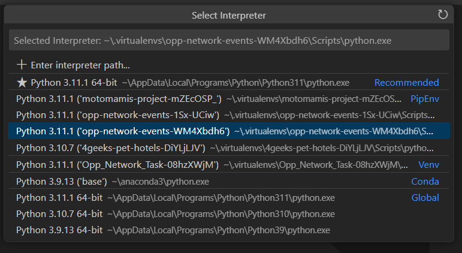

# Opportunity Network Events Django Task

## Installation

Follow this steps to run the project in your machine.

### Github

- download by cloning the repo:

```shell
git clone https://github.com/marcelrm11/opp-network-events.git
cd ./opp-network-events
```

### Backend: Python-Django

- this project uses python 3.11.1, check your system and download it if needed.
- also install pipenv if needed:

```shell
python --version
python3 --version [for Mac users]
pip install pipenv [or pip3]
```

- create virtual environment, install dependencies and activate the subshell:

```shell
pipenv install
pipenv shell
```

- select the python interpreter created for this virtual environment, on VS Command Palette. It should have a path stating your virtual environment directory. This will enable the virtual environment for the new terminals opened in this project.



#### Database configuration:

- create database, open a new terminal window

```shell
createdb my-db-name
```

- in `settings.py` under DATABASES, configure your database connection, editting the name, user, password, host and port for your database connection.

- apply migrations:

```shell
python manage.py migrate
```

- populate with mock data (optional), you can use the sql files found in the "events" directory. I use pgAdmin and copy paste the files. First the users file and after, the events file.
- then, you'll need to run this queries to set the current id values for both tables:

```sql
SELECT setval('events_user_id_seq', (SELECT MAX(id) FROM events_user));
SELECT setval('events_event_id_seq', (SELECT MAX(id) FROM events_event));
```

- you can check the current values like this:

```sql
SELECT currval(pg_get_serial_sequence('events_user', 'id'));
SELECT currval(pg_get_serial_sequence('events_event', 'id'));
```

- next, go back to your virtual environment terminal window, and create a superuser:

```shell
python manage.py createsuperuser
```

follow the steps and then go to the backend URL.

- you can go to "/admin" for the admin site (here you should log in with your super user credentials)
- you can go to "/events" for the rest api site (here you can use Django REST framework to test API endpoints).
  Note that you need to comment this code in `settings.py` to test the endpoints without passing the Authorization token every time:
  ```python
  REST_FRAMEWORK = {
    'DEFAULT_AUTHENTICATION_CLASSES': [
        'rest_framework.authentication.TokenAuthentication',
    ],
    }
  ```

### Frontend: React-Vite

- to start the frontend, you must first cd in "frontend" directory:

```shell
cd ./frontend
```

- install dependencies and run the app in development mode:

```shell
npm install
```

## Run the project

- start the backend server from the project root:

```shell
python manage.py runserver
```

by default, it will start at http://127.0.0.1:8000/
this is used by the frontend to make api calls to the database

- run the project from the frontend directory:

```shell
npm run dev
```

by default, it will start at http://127.0.0.1:5173/
this is where the app can be accessed
